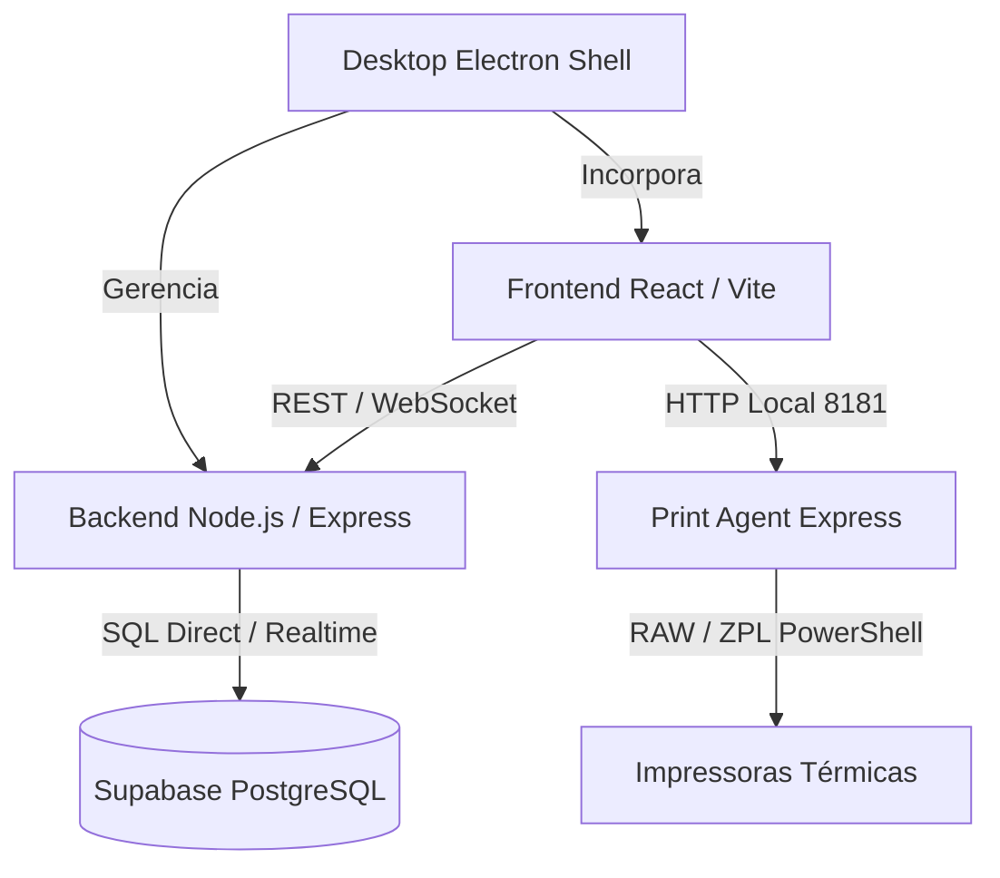

# 🚀 Rotas Pro — Sistema Inteligente de Triagem e Roteirização Logística

> **Caponi Logística** — Plataforma completa monorepo para triagem de encomendas por código de barras, otimização de rotas de entrega via OSRM/OpenStreetMap/Mapbox, gerenciamento de malotes, impressão térmica em tempo real e aplicativo desktop Electron.

---

## 📌 Sumário
1. [Visão Geral](#-visão-geral)
2. [Arquitetura do Sistema](#-arquitetura-do-sistema)
3. [Principais Funcionalidades](#-principais-funcionalidades)
4. [Tecnologias Utilizadas](#-tecnologias-utilizadas)
5. [Estrutura de Pastas](#-estrutura-de-pastas)
6. [Pré-requisitos](#-pré-requisitos)
7. [Configuração do Ambiente (.env)](#-configuração-do-ambiente-env)
8. [Como Executar o Projeto](#-como-executar-o-projeto)
   - [Desenvolvimento Local](#1-desenvolvimento-local)
   - [Aplicativo Desktop (Electron)](#2-aplicativo-desktop-electron)
   - [Agente de Impressão Térmica](#3-agente-de-impressão-térmica)
9. [Geração de Instalador Executável (.exe)](#-geração-de-instalador-executável-exe)
10. [Banco de Dados & Supabase](#-banco-de-dados--supabase)
11. [Licença](#-licença)

---

## 📖 Visão Geral

O **Rotas Pro** é uma solução de nível empresarial desenvolvida para automatizar a triagem, separação, roteirização e expedição de malotes e pacotes de logística. O sistema combina:
- **Bipagem Ultra-rápida**: Leitura em lote por leitor óptico/scanner USB ou câmera web.
- **Roteirização e Geocodificação Inteligente**: Agrupamento por bairros, faixas de CEP e otimização geométrica de rotas (OSRM / OpenStreetMap / Mapbox).
- **Impressão Térmica Direta**: Agente local via WebSocket/HTTP para envio rápido de comandos ZPL/EPL/RAW para impressoras térmicas (Zebra, Elgin, Bematech).
- **Modo Desktop Completo**: Distribuído como aplicação Electron offline-ready para Windows.

---

## 🏗 Arquitetura do Sistema



---

## ✨ Principais Funcionalidades

- **Triagem & Scanner**:
  - Leitura contínua de códigos de barras (bipagem individual ou múltipla em lote).
  - Validação instantânea de pacotes duplicados e triagem por bairros/rotas.
  - Indicadores sonoros e visuais configuráveis.
- **Gerenciamento de Malotes (Bags)**:
  - Criação, fechamento, etiquetagem e gerenciamento de status de malotes.
  - Geração de código QR e código de barras único para cada malote.
- **Roteirização e Rastreamento**:
  - Geração de sequenciamento ideal de entregas.
  - Visualização gráfica de rotas em mapa interativo.
  - Cálculo de distâncias, estimativa de tempo e estatísticas por rota.
- **Impressão Térmica de Etiquetas**:
  - Integração nativa com impressoras térmicas no Windows sem diálogos de impressão.
  - Suporte a ZPL/EPL e formatação customizada de etiquetas de malote e pacote.
- **Exportação & Relatórios**:
  - Exportação em CSV, Excel (XLSX) e PDF para manifestos de carga.

---

## 🛠 Tecnologias Utilizadas

- **Frontend**: React 19, TypeScript, Vite, TailwindCSS, Lucide Icons, TanStack Query, Zustand, Recharts, ZXing Scanner.
- **Backend**: Node.js, Express, TypeScript, Supabase Client (`@supabase/supabase-js`), WebSockets (`ws`), Helmet, Rate-Limit.
- **Desktop App**: Electron 29, Electron Builder, PowerShell Integrations.
- **Print Agent**: Node.js, Express, Native Windows PowerShell `Out-Printer` printing.
- **Banco de Dados**: PostgreSQL via Supabase (Tabelas, RLS Policies, Indexes, Triggers, Migrations SQL).

---

## 📁 Estrutura de Pastas

```
PROJETO CAPONI/
├── api/                    # Handler Serverless Vercel / Endpoints de API
├── backend/                # API REST Node.js/TypeScript
│   ├── src/                # Controllers, Services, Routes, Middlewares
│   └── .env.example        # Exemplo de variáveis de ambiente
├── desktop/                # Wrapper Electron para Windows (.exe)
│   ├── src/                # Main process e Preload scripts
│   └── build/              # Ícones e assets do executável
├── frontend/               # Interface Web React + Vite
│   ├── src/                # Componentes, Páginas, Hooks, Stores
│   └── .env.example        # Exemplo de variáveis de ambiente
├── print-agent/            # Serviço local de impressão térmica em segundo plano
│   ├── src/                # Servidor Express local (Porta 8181)
│   └── .env.example        # Exemplo de variáveis de ambiente
├── supabase/               # Migrações SQL e Seed de dados
│   ├── migrations/         # Scripts de migração de banco
│   └── seed.sql            # Dados iniciais para testes
├── GERAR_INSTALADOR_EXE.bat# Script para compilar o executável Windows
├── INICIAR_CAPONI_DESKTOP.bat# Script para iniciar a aplicação localmente
├── package.json            # Scripts globais do monorepo
└── README.md               # Documentação principal
```

---

## ⚙️ Pré-requisitos

- **Node.js**: `v18.x` ou superior (recomendado `v20.x` LTS).
- **npm**: `v9.x` ou superior.
- **Git**: instalado no sistema.
- **Conta Supabase**: Para hospedar a instância do banco PostgreSQL (ou Supabase CLI para execução local).

---

## 🔑 Configuração do Ambiente (.env)

Em cada módulo do projeto, renomeie os arquivos `.env.example` para `.env` e defina os valores adequados:

### 1. `backend/.env`
```env
SUPABASE_URL=https://seu-projeto.supabase.co
SUPABASE_ANON_KEY=sua_chave_anon
SUPABASE_SERVICE_KEY=sua_chave_service_role
PORT=3001
NODE_ENV=development
FRONTEND_URL=http://localhost:5173
DEFAULT_ORG_ID=00000000-0000-0000-0000-000000000001
```

### 2. `frontend/.env`
```env
VITE_SUPABASE_URL=https://seu-projeto.supabase.co
VITE_SUPABASE_ANON_KEY=sua_chave_anon
VITE_API_URL=http://localhost:3001
VITE_PRINT_AGENT_URL=http://localhost:8181
VITE_DEFAULT_ORG_ID=00000000-0000-0000-0000-000000000001
```

### 3. `print-agent/.env`
```env
PORT=8181
NODE_ENV=development
```

---

## 🚀 Como Executar o Projeto

### 1. Desenvolvimento Local

Instale as dependências nos módulos:
```bash
# Na raiz do projeto:
cd backend && npm install
cd ../frontend && npm install
cd ../print-agent && npm install
cd ../desktop && npm install
```

Para iniciar os serviços simultaneamente em terminais separados:

**Backend API (Porta 3001):**
```bash
cd backend
npm run dev
```

**Frontend React/Vite (Porta 5173):**
```bash
cd frontend
npm run dev
```

**Print Agent (Porta 8181):**
```bash
cd print-agent
npm run dev
```

---

### 2. Aplicativo Desktop (Electron)

Você pode iniciar o app Desktop executando o script automatizado na raiz do projeto:
```cmd
INICIAR_CAPONI_DESKTOP.bat
```
Ou via terminal:
```bash
npm run desktop:start
```

---

### 3. Agente de Impressão Térmica

O `print-agent` roda localmente na máquina do operador de triagem na porta `8181`. Ele escuta chamadas do frontend e envia comandos de impressão direta via PowerShell (`Out-Printer`) para a impressora configurada sem necessitar de driver específico ou caixa de diálogo.

---

## 📦 Geração de Instalador Executável (.exe)

Para compilar e empacotar a aplicação em um instalador autônomo para Windows (`.exe` NSIS e Portable):

Execute o script de automação:
```cmd
GERAR_INSTALADOR_EXE.bat
```
O executável final será gerado em: `desktop/dist-electron/Rotas Pro Setup 1.0.0.exe`.

---

## 🗄 Banco de Dados & Supabase

As tabelas do banco de dados, índices e permissões (RLS) estão organizadas no diretório `supabase/`.
Para aplicar a estrutura no seu projeto Supabase:
1. Acesse o **SQL Editor** no painel do Supabase.
2. Execute o conteúdo de `supabase/seed.sql` ou aplique as migrações na pasta `supabase/migrations/`.

---

## 📄 Licença

Este projeto é de uso exclusivo da **Caponi Logística / Rotas Pro**. Todos os direitos reservados.
